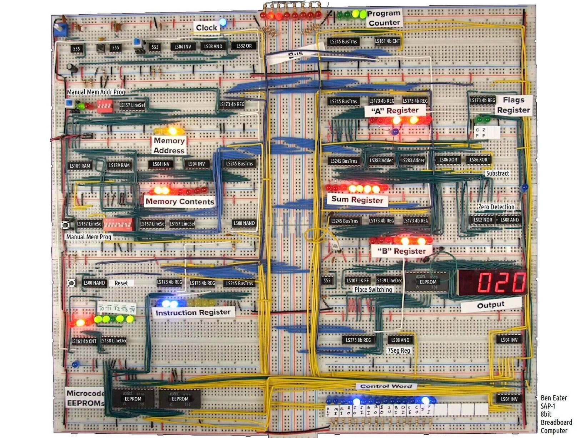
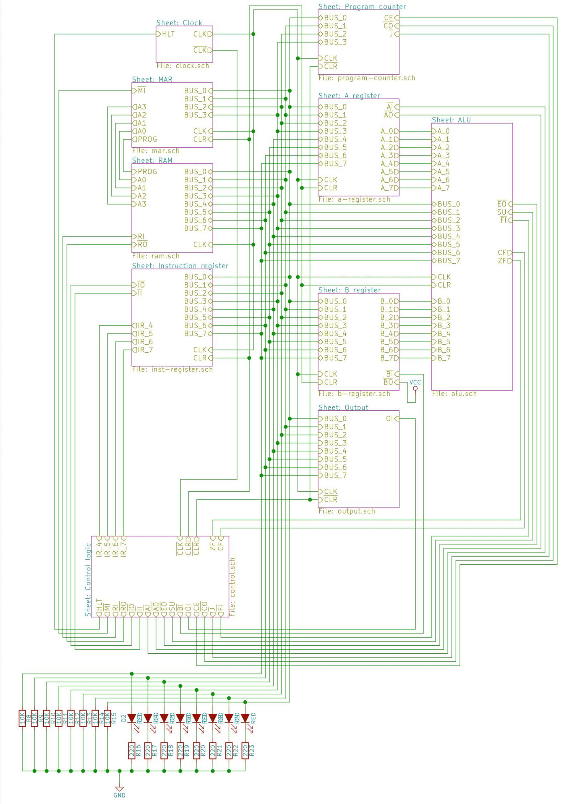
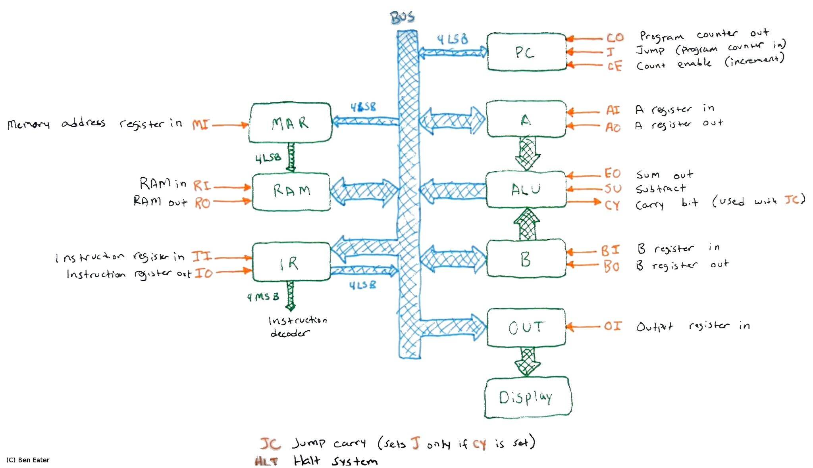

<!---

This file is used to generate your project datasheet. Please fill in the information below and delete any unused
sections.

You can also include images in this folder and reference them in the markdown. Each image must be less than
512 kb in size, and the combined size of all images must be less than 1 MB.
-->

# How it works

This is Ben Eater's 8 Bit computer on an ASIC!

All credit for the design, amazing instructional videos, and diagams below goes to Ben Eater.

## High level overview

Full Computer Schematic:

Simple Control Signal Diagram:

*Note: The output register and logic to display the digits is not included on the ASIC. The 8 bit output value is put on the bus and the "output register in" control signal (oi) is on an output pin. This way you can use the data bus as a general purpose interface to any display you want. (i.e. you can read in the data to the RP2040 and show it on the screen, you can build the actual output register as shown in the videos and connect it to the PMOD header, etc.)

# How to test

To program the computer follow these steps:
  - enable my design in TT
  - send prog_mode bit high
  - set the four prog_address bits to the address you want to write to, put the data you want to store at that address on the I/O lines, and then pulse the clock.
  - since this computer only has a 4 bit address space you can only store 16 bytes total in the internal RAM.
  - see https://eater.net/8bit/ for more details.
  
## Instructions
| OPC | DEC | HEX  | DESCRIPTION                                                    |
|-----|-----|------|----------------------------------------------------------------|
| NOP | 00  | 0000 |                                                                |
| LDA | 01  | 0001 | Load contents of memory address aaaa into register A.          |
| ADD | 02  | 0010 | Put content of memory address aaaa into register B, add A + B, store result in A. |
| SUB | 03  | 0011 | Put content of memory address aaaa into register B, subtract A - B, store result in register A. |
| STA | 04  | 0100 | Store contents of register A at memory address aaaa.           |
| LDI | 05  | 0101 | Load 4 bit immediate value in register A (loads 'vvvv' in A).   |
| JMP | 06  | 0110 | Unconditional jump. Set program counter (PC) to aaaa, resume execution from that memory address. |
| JC  | 07  | 0111 | Jump if carry. Set PC to aaaa when carry flag is set and resume from there. When carry flag is not set, resume normally. |
| JZ  | 08  | 1000 | Jump if zero. As above, but when zero flag is set.              |
|     | 09  | 1001 |                                                                |
|     | 10  | 1010 |                                                                |
|     | 11  | 1011 |                                                                |
|     | 12  | 1100 |                                                                |
|     | 13  | 1101 |                                                                |
| OUT | 14  | 1110 | Output register A to 7 segment LED display as decimal.         |
| HLT | 15  | 1111 | Halt execution.                                                |

# External hardware

You will need the RP2040 or a similar microcontroller to write the program into the internal memory. If you really wanted to, you could go old school and use DIP switches and a manual clock pulse as well.

You will want to make the output register on a breadboard to connect it to the 8 bit I/O lines from the PMOD header. See https://eater.net/8bit/output for detailed design info.
